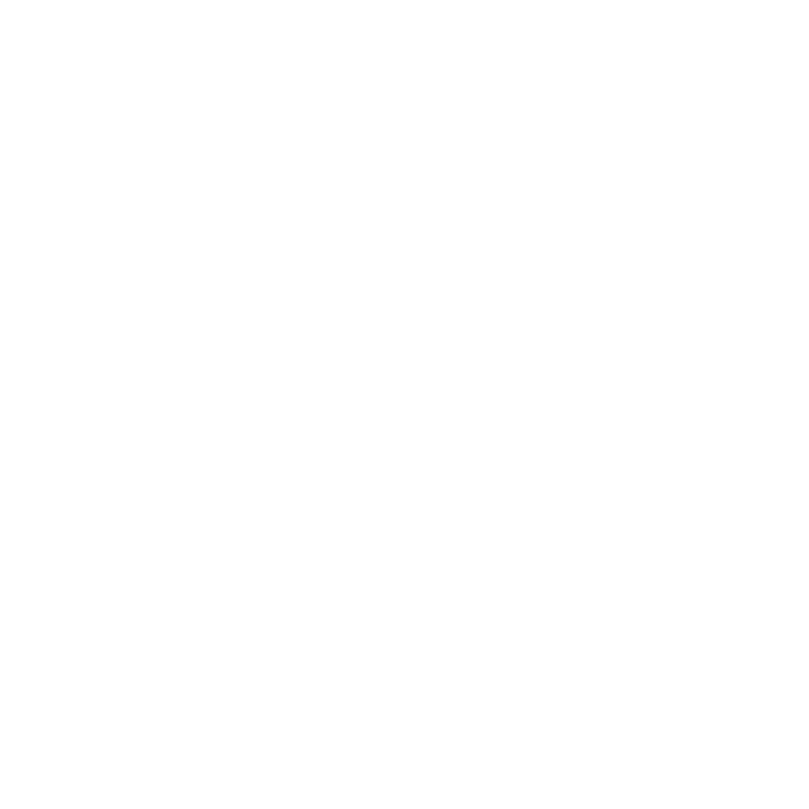

    <picture>
        <source media="(prefers-color-scheme: dark)" srcset="PartiQL_Logo_Dark.svg">
        <source media="(prefers-color-scheme: light)" srcset="PartiQL_Logo_Light.svg">
        
    </picture>

PartiQL is an expressive, SQL-compatible query language giving access to relational, semi-structured, and nested data. PartiQL is Open Sourced under PartiQL is open-sourced under the Apache 2.0 License. 

## Contributions

* If you have questions or ideas towards PartiQL as a Language, check out our [GitHub Discussion](https://github.com/orgs/partiql/discussions) forum.
* Check out the [CONTRIBUTING.md](../CONTRIBUTING.md) file to learn how to contribute.

## Resources
- Two reference Implementations:  [PartiQL-Lang-Kotlin](https://github.com/partiql/partiql-lang-kotlin) and [PartiQL-Lang-Rust](https://github.com/partiql/partiql-lang-rust). 
- [Tutorial](https://partiql.org/tutorial.html) and [documentations](https://partiql.org/dql/overview.html). 
- [PartiQL Specification](https://partiql.org/assets/PartiQL-Specification.pdf)

---

This project has adopted the Amazon [Open Source Code of Conduct](../CODE_OF_CONDUCT.md). Copyright PartiQL Contributors.
